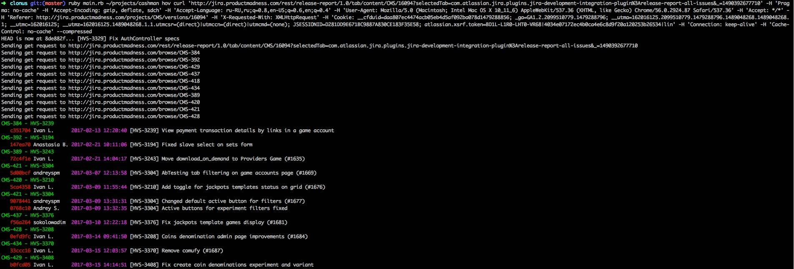
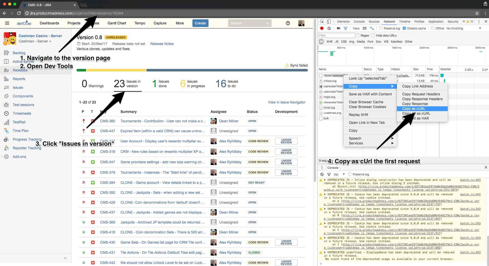

Less Cloning, More Coding

## Usage
Check whether clone tickets were committed in current branch or not.

```bash
./main.rb ~/projects/cashman curl 'http://jira.productmadness.com/rest/release-report/1.0/tab/content/CMS/16094?selectedTab=com.atlassian.jira.plugins.jira-development-integration-plugin%3Arelease-report-all-issues&_=1490392677710' -H 'Pragma: no-cache' -H 'Accept-Encoding: gzip, deflate, sdch' -H 'Accept-Language: ru-RU,ru;q=0.8,en-US;q=0.6,en;q=0.4' -H 'User-Agent: Mozilla/5.0 (Macintosh; Intel Mac OS X 10_11_6) AppleWebKit/537.36 (KHTML, like Gecko) Chrome/56.0.2924.87 Safari/537.36' -H 'Accept: */*' -H 'Referer: http://jira.productmadness.com/projects/CMS/versions/16094' -H 'X-Requested-With: XMLHttpRequest' -H 'Cookie: __cfduid=daa807ec4474acb05eb4d5af092ba078d1479288856; _ga=GA1.2.2099510779.1479288796; __utma=162016125.2099510779.1479288796.1489048268.1489048268.1; __utmc=162016125; __utmz=162016125.1489048268.1.1.utmcsr=(direct)|utmccn=(direct)|utmcmd=(none); JSESSIONID=D281DD9E671BC9887A830CE183F35E58; atlassian.xsrf.token=BD1L-L1R0-LHT0-VR68|4034e07172ec4b0ca4e6c8d9f20a120253b26534|lin' -H 'Connection: keep-alive' -H 'Cache-Control: no-cache' --compressed

```

Arguments:

1. `~/projects/cashman` - path to Cashman project
2. `curl ...` - cUrl request to "Issues in version" page in JIRA. To get it you need
    1. Navigate to JIRA Version page in browser
    2. Open Dev Tools
    3. Click "Issues in version"
    4. Copy as cUrl the first request


